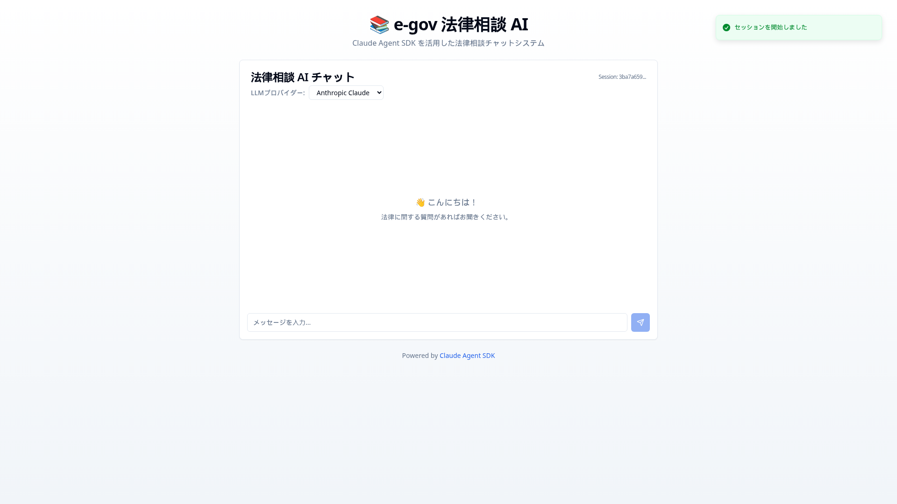
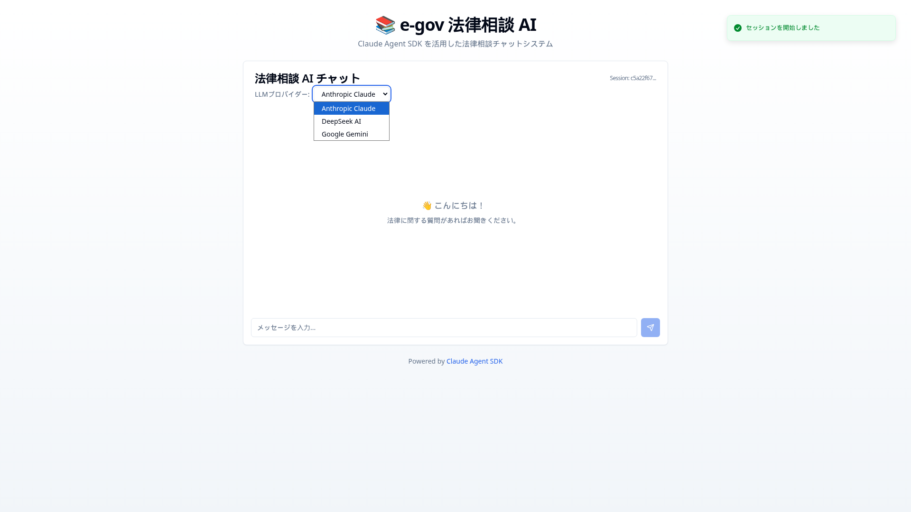
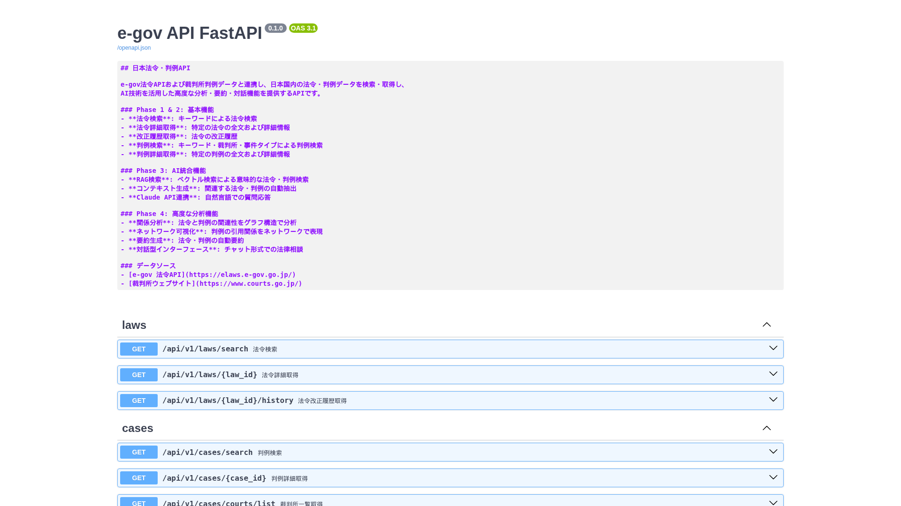
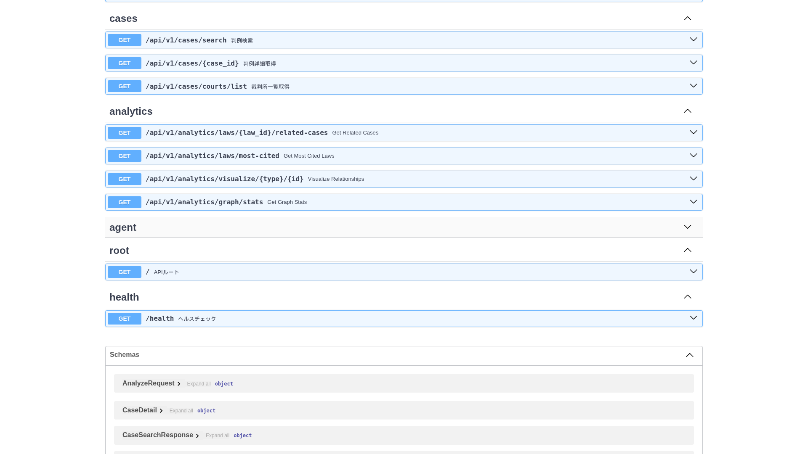

<div align="center">

# 📚 e-gov API FastAPI Agent SDK

**日本の法令・判例データを提供する高速APIサーバー with AI Agent**

[](https://fastapi.tiangolo.com/)
[](https://www.python.org/)
[](https://nextjs.org/)
[](https://docs.claude.com/ja/docs/agent-sdk)
[]()
[](https://www.postgresql.org/)
[](https://redis.io/)
[](https://www.docker.com/)
[](https://podman.io/)
[](https://github.com/astral-sh/uv)
[](https://pnpm.io/)
[](LICENSE)

> **Fork元**: [clearclown/e-gov-api-fastAPI](https://github.com/clearclown/e-gov-api-fastAPI)
> このプロジェクトは元のRESTful APIに **Claude Agent SDK**、**マルチLLMプロバイダー対応**、**Next.js フロントエンド** を統合した拡張版です。

[🇯🇵 日本語](README.md) | [🇬🇧 English](docs/readmeLang/README.en.md) | [🇨🇳 简体中文](docs/readmeLang/README.zh-CN.md) | [🇹🇼 繁體中文](docs/readmeLang/README.zh-TW.md) | [🇷🇺 Русский](docs/readmeLang/README.ru.md) | [🇮🇷 فارسی](docs/readmeLang/README.fa.md) | [🇸🇦 العربية](docs/readmeLang/README.ar.md)

</div>

---

## 📸 スクリーンショット

<div align="center">

### 💬 フロントエンド - チャットUI



*Next.js 15 + TypeScript による AI チャットインターフェース*

---

### 🔄 マルチLLMプロバイダー選択



*Anthropic Claude / DeepSeek AI / Google Gemini をUIから切り替え*

---

### 📚 API ドキュメント (Swagger UI)



*FastAPI による自動生成 API ドキュメント*

---

### 🤖 Agent API エンドポイント



*Claude Agent SDK 統合エンドポイント*

</div>

---

## 📖 簡単な説明

**e-gov API FastAPI Agent SDK** は、日本の法令および判例データに高速アクセスできるRESTful APIサーバーです。

[e-gov 法令API](https://elaws.e-gov.go.jp/) および [裁判所ウェブサイト](https://www.courts.go.jp/) と連携し、リアルタイムで最新の法律情報を提供します。

**Anthropic Claude Agent SDK** を統合し、単なるデータ検索を超えた**エージェント型の法律支援機能**を実現します。

**主な機能:**
- 🔍 法令検索・詳細取得・改正履歴
- ⚖️ 判例検索・詳細取得
- 📊 法令と判例の関係性分析
- 🚀 Redisキャッシュによる高速化
- 🌐 VPN/Tailscale対応
- 🤖 **Claude Agent SDK による AI エージェント機能**
  - 自然言語での法律検索
  - コンテキストを保持した対話型法律相談
  - 複数文書の横断的分析
  - 法令と判例の関連性の自動抽出
- 🔄 **マルチLLMプロバイダー対応** (NEW!)
  - **Anthropic Claude** - Claude Agent SDK で最高品質の法律分析
  - **DeepSeek AI** - コスト効率の高い基本的なチャット
  - **Google Gemini** - Googleの最新LLMモデル
  - UIでリアルタイム切り替え可能
- 💬 **Next.js 15 フロントエンド** (NEW!)
  - モダンなチャットUI
  - ストリーミングレスポンス対応
  - プロバイダー選択機能
  - TypeScript + Tailwind CSS

---

## 🎯 なぜこれが必要なのか + 何をするものなのか

### 課題

日本の法律情報にアクセスする際、以下の問題があります：

- **法令データの散在**: 政府APIは使いづらく、ドキュメント不足
- **判例データの取得困難**: 体系的なAPIが存在しない
- **データ統合の複雑さ**: 法令と判例の関連性を分析する仕組みがない

### 解決策

このAPIサーバーは、複数のデータソースを統合し、開発者が簡単に日本の法律情報にアクセスできるようにします。

**何をするものなのか:**
- 法令データベースへの統一的なアクセス
- 判例データの検索・取得
- 法令と判例の関係性分析
- 高速レスポンス（キャッシュ機能）
- **Claude Agent SDK による AI エージェント機能**
  - 自然言語での法律質問に回答
  - 長文法律文書の自動要約
  - 複数の法令・判例を横断した分析
  - コンテキストを保持した対話型相談

**ユースケース:**
- 法律相談アプリケーションのバックエンド
- リーガルテック製品の基盤API
- 法律データ分析・研究
- 法令改正の自動追跡システム
- **AI による法律相談チャットボット**
- **判例研究の自動化**
- **法律文書の意味的検索**

---

## 🤖 Claude Agent SDK の強み

このプロジェクトでは、**Anthropic Claude Agent SDK** を活用することで、単なる法律データベースAPIを超えた、真のエージェント型法律支援システムを構築します。

### なぜ Claude Agent SDK なのか？

**1. 自動コンテキスト管理 🧠**
- 法律文書は非常に長大（数百条文の法律、数十ページの判例）
- SDK の自動コンテキスト圧縮により、長時間の分析セッションでもコンテキストウィンドウが枯渇しない
- 複数の法令・判例を横断的に分析する際に不可欠

**2. 統合ツールエコシステム 🛠️**
- ファイル操作、コード実行、Web検索が組み込み済み
- 法令XMLの処理、判例PDFの抽出、クロスリファレンス分析に必須
- カスタム統合を最小限に抑え、開発速度を向上

**3. MCP による拡張性 🔌**
- `search_law`, `search_case`, `analyze_relationship` などのカスタムツールを簡単に追加
- 法律ドメイン特化の機能を MCP サーバーとして実装
- 将来的な機能追加（商用判例データベース連携など）が容易

**4. 本番環境対応 🚀**
- 政府APIの不安定性に対応するエラーハンドリング
- 長時間の法律調査に対応するセッション管理
- コンプライアンス要件に対応する監査ログ（Hook システム）
- 自動プロンプトキャッシングによるコスト削減

**5. きめ細かい権限制御 🔒**
- 法律データは機密性が高い場合がある
- `allowedTools`, `disallowedTools`, `permissionMode` で正確な権限設定
- 企業向けデプロイ時のセキュリティ要件に対応

### SDK が実現する高度な機能

**ステートレスクエリ (`query`):**
```python
# 一回限りの法律文書要約
result = await query("この契約書の法的リスクを分析してください")
```

**ステートフルセッション (`ClaudeSDKClient`):**
```python
# 継続的な法律相談
client = ClaudeSDKClient()
await client.query("憲法第21条について教えてください")
await client.query("関連する判例はありますか？")  # コンテキスト保持
await client.query("最新の学説の動向は？")        # 会話が継続
```

**MCP カスタムツール（TOON形式）:**
```python
@tool(
    name="search_law",
    description="法令検索",
    # TOON形式でスキーマ定義（JSONより30-60%トークン削減）
    input_schema="""
type: object
properties:
  query: {type: string, description: 検索クエリ}
  category: {type: string, enum[4]: constitution,law,ordinance,rule}
  limit: {type: integer, default: 10}
required[1]: query
""",
)
async def search_law(args):
    # e-gov API を呼び出し、結果を返す
    results = await egov_client.search(args["query"])
    return {"content": [{"type": "text", "text": results}]}
```

**Hook システム（監査ログ）:**
```python
class ComplianceHook(Hook):
    async def on_pre_tool_use(self, tool_name, args):
        # すべてのツール使用を記録
        await log_legal_data_access(tool_name, args)
```

**セッション分岐（並列分析）:**
```python
# 同じ法令について異なる解釈を並列分析
interpretation_a = client.fork_session()
interpretation_b = client.fork_session()

results = await asyncio.gather(
    interpretation_a.query("文理解釈を行ってください"),
    interpretation_b.query("立法趣旨から解釈してください"),
)
```

### 他のアプローチとの比較

| 機能 | 直接 Claude API | LangChain/LlamaIndex | **Claude Agent SDK** |
|------|----------------|---------------------|---------------------|
| コンテキスト管理 | 手動実装が必要 | 基本的なサポート | ✅ 自動圧縮 |
| ツール統合 | 関数呼び出しのみ | プラグイン形式 | ✅ MCP 標準 |
| セッション管理 | 自前実装 | メモリストア | ✅ 組み込み |
| エラーハンドリング | 自前実装 | 基本的なリトライ | ✅ 本番対応 |
| 監査ログ | 自前実装 | プラグイン | ✅ Hook システム |
| Claude 最適化 | なし | 一般的な最適化 | ✅ 専用最適化 |
| **スキーマ形式** | **JSON** | **JSON** | **✅ TOON (30-60% トークン削減)** |

**結論**: Claude Agent SDK は、本格的なエージェント型法律支援システムを構築するための最適なフレームワークです。

---

## 🔄 マルチLLMプロバイダー対応 (このフォークの独自機能)

このプロジェクトでは、**複数のLLMプロバイダー**をサポートし、用途に応じて最適なAIモデルを選択できます。

### 対応プロバイダー

| プロバイダー | 特徴 | ユースケース | Agent SDK | MCP Tools |
|------------|------|-------------|-----------|-----------|
| **🔵 Anthropic Claude** | 最高品質の法律分析<br/>長文理解に優れる | 複雑な法律文書分析<br/>判例研究<br/>高度な法律相談 | ✅ 完全対応 | ✅ 利用可能 |
| **🟢 DeepSeek AI** | コスト効率が高い<br/>基本的なチャット | 簡単な質問応答<br/>要約生成<br/>コスト重視の用途 | ❌ 基本機能のみ | ❌ 非対応 |
| **🔴 Google Gemini** | Googleの最新モデル<br/>マルチモーダル | 一般的な法律質問<br/>多言語対応<br/>画像分析 | ❌ 基本機能のみ | ❌ 非対応 |

### 技術的実装

**統一インターフェース（Adapter Pattern）:**
```python
from app.services.llm import BaseLLMClient, create_llm_client

# 抽象基底クラスで統一されたインターフェース
class BaseLLMClient(ABC):
    @abstractmethod
    async def query(self, message: str) -> AsyncIterator[Dict]:
        pass

# ファクトリーパターンで動的にプロバイダーを生成
client = create_llm_client(
    provider="anthropic",  # or "deepseek", "gemini"
    api_key="your-api-key",
    model="claude-3-5-sonnet-20241022"
)
```

**API エンドポイントでのプロバイダー指定:**
```bash
# Anthropic Claude を使用
curl -X POST http://localhost:8000/api/v1/agent/chat \
  -H "Content-Type: application/json" \
  -d '{"message": "労働法について教えてください", "provider": "anthropic"}'

# DeepSeek AI を使用
curl -X POST http://localhost:8000/api/v1/agent/chat \
  -H "Content-Type: application/json" \
  -d '{"message": "労働法について教えてください", "provider": "deepseek"}'

# Google Gemini を使用
curl -X POST http://localhost:8000/api/v1/agent/chat \
  -H "Content-Type: application/json" \
  -d '{"message": "労働法について教えてください", "provider": "gemini"}'
```

### フロントエンドでのプロバイダー切り替え

Next.js フロントエンドでは、UIから簡単にプロバイダーを切り替えられます：

```typescript
// プロバイダー選択ドロップダウン
<select value={provider} onChange={(e) => setProvider(e.target.value)}>
  <option value="anthropic">Anthropic Claude</option>
  <option value="deepseek">DeepSeek AI</option>
  <option value="gemini">Google Gemini</option>
</select>
```

### API キー設定

`.env` ファイルで各プロバイダーのAPIキーを設定：

```bash
# デフォルトプロバイダー
DEFAULT_LLM_PROVIDER=anthropic

# Anthropic Claude
ANTHROPIC_API_KEY=sk-ant-your-key-here
CLAUDE_MODEL=claude-3-5-sonnet-20241022

# DeepSeek AI
DEEPSEEK_API_KEY=sk-your-deepseek-key-here
DEEPSEEK_MODEL=deepseek-chat

# Google Gemini
GOOGLE_API_KEY=your-google-api-key-here
GEMINI_MODEL=gemini-2.0-flash-exp
```

### プロバイダー選択のベストプラクティス

**🔵 Anthropic Claude を使う場合:**
- 複雑な法律文書の分析
- 長文の判例研究
- 高度な論理的推論が必要な相談
- MCP カスタムツールを活用した検索

**🟢 DeepSeek AI を使う場合:**
- シンプルな質問応答
- コスト削減が最優先
- 基本的な要約生成
- 大量の簡単なクエリ処理

**🔴 Google Gemini を使う場合:**
- 最新のGoogleモデルを試したい
- マルチモーダル機能（画像分析など）
- 多言語対応が必要

---

## 🎨 TOON Format: 次世代の構造化データ

このプロジェクトでは、MCP ツール定義に **TOON (Tool-Oriented Object Notation)** を採用しています。

### TOON とは？

**TOON** は、LLM 向けに最適化された構造化データフォーマットで、JSON と比較して **30-60% のトークン削減** を実現します。

### 主な利点

| 項目 | JSON | TOON | 改善率 |
|------|------|------|--------|
| **トークン数** | 120 トークン | 50 トークン | **58% 削減** |
| **可読性** | 中程度 | 高い | ✅ |
| **コスト** | 高い | 低い | **60% 削減** |
| **記述量** | 多い | 少ない | **45-60% 削減** |

### 構文比較

**従来の JSON:**
```json
{
  "type": "object",
  "properties": {
    "query": {"type": "string", "description": "検索クエリ"},
    "limit": {"type": "integer", "default": 10}
  },
  "required": ["query"]
}
```

**TOON 形式:**
```
type: object
properties:
  query: {type: string, description: 検索クエリ}
  limit: {type: integer, default: 10}
required[1]: query
```

**削減率: 58%** 🎉

### なぜ法律データに最適なのか？

法律情報システムでは、以下の理由から TOON が特に有効です：

1. **大量のツール呼び出し**: 法令・判例検索で頻繁にツールを使用
2. **長時間セッション**: 法律相談は複数のクエリを含む長い会話
3. **コスト削減**: トークン削減により API コストを大幅に削減
4. **均一なデータ構造**: 法令・判例データは構造が統一されており、TOON の表形式が最適

### TOON の実例

**法令検索結果（表形式）:**
```
results[100,]{law_id,name,law_num,enforcement_date}:
  LAW001,憲法,昭和21年憲法,1947-05-03
  LAW002,民法,明治29年法律第89号,1898-07-16
  LAW003,刑法,明治40年法律第45号,1908-10-01
  ...
```

**従来の JSON なら 3000+ トークン → TOON なら 1200 トークン（60% 削減）**

### 詳細情報

- [TOON 公式ドキュメント（Zenn）](https://zenn.dev/akasan/articles/1fa9ad262ac719)
- [python-toon ライブラリ](https://github.com/akasan/python-toon)
- CLAUDE.md の "TOON vs JSON: Migration Guide" セクション参照

---

## 🚀 クイックスタート（推奨）

### 1コマンドで起動する方法

このプロジェクトは **自動セットアップシステム** を搭載しており、環境確認からサーバー起動までを1つのコマンドで実行できます。

#### 方法1: Makefile を使用（推奨）

```bash
# リポジトリのクローン
git clone https://github.com/clearclown/e-gov-api-CC-Agentic-SDK.git
cd e-gov-api-CC-Agentic-SDK

# 🎯 初回セットアップ（uv確認→インストール→環境構築）
make setup

# 🚀 APIサーバー起動
make start

# または、MCPサーバーも同時起動
make start-all
```

#### 方法2: Python CLI を使用

```bash
# 初回セットアップ
python dev.py setup

# APIサーバー起動
python dev.py start

# または、MCPサーバー起動
python dev.py mcp
```

### 自動セットアップの内容

`make setup` または `python dev.py setup` は以下を自動実行します：

1. ✅ **uv の確認**：インストールされていない場合は自動インストール
2. ✅ **仮想環境の作成**：`.venv` ディレクトリを作成
3. ✅ **依存関係のインストール**：すべてのPythonパッケージをインストール
4. ✅ **環境変数の設定**：`.env.example` から `.env` を作成
5. ✅ **環境の確認**：すべてのコンポーネントが正しく設定されているか検証

### 利用可能なコマンド一覧

#### Makefile コマンド

| コマンド | 説明 |
|---------|------|
| `make setup` | 初回セットアップ（uv確認→インストール→環境構築） |
| `make check` | 環境確認（依存パッケージのチェック） |
| `make start` | APIサーバー起動 |
| `make start-mcp` | MCPサーバー起動 |
| `make start-all` | API + MCPサーバー同時起動（tmux使用） |
| `make test` | テスト実行 |
| `make test-live` | 実際のAPIを使用したテスト |
| `make clean` | キャッシュクリア |
| `make help` | ヘルプ表示 |

#### dev.py コマンド

```bash
python dev.py <command>

# 利用可能なコマンド:
#   setup   - 初回セットアップ
#   check   - 環境確認
#   start   - APIサーバー起動
#   mcp     - MCPサーバー起動
#   test    - テスト実行
#   clean   - キャッシュクリア
#   help    - ヘルプ表示
```

### アクセス

セットアップ完了後、以下のURLにアクセスできます：

- **API ドキュメント**: http://localhost:8000/docs
- **ReDoc**: http://localhost:8000/redoc
- **ヘルスチェック**: http://localhost:8000/health

### API キーの設定

Claude Agent SDK を使用するには、Anthropic API キーが必要です：

```bash
# .env ファイルを編集
ANTHROPIC_API_KEY=sk-ant-your-api-key-here

# 使用するモデルを選択（オプション）
CLAUDE_MODEL=claude-3-5-sonnet-20241022
```

利用可能なモデル：
- `claude-3-5-sonnet-20241022` (デフォルト、高性能)
- `claude-3-opus-20240229` (最高品質)
- `claude-3-sonnet-20240229` (バランス型)
- `claude-3-haiku-20240307` (高速・低コスト)

---

## 🚀 Installation（従来の方法）

### 必要な環境

- Python 3.12+
- Docker または Podman
- uv (パッケージマネージャー)

### 方法1: Docker/Podman で起動

```bash
# リポジトリのクローン
git clone https://github.com/clearclown/e-gov-api-CC-Agentic-SDK.git
cd e-gov-api-CC-Agentic-SDK

# 環境変数の設定
cp .env.example .env

# 起動
podman compose up -d
# または
docker compose up -d

# 動作確認
curl http://localhost:8000/health
```

### 方法2: uv で開発環境セットアップ

```bash
# uv のインストール
curl -LsSf https://astral.sh/uv/install.sh | sh

# 仮想環境の作成
uv venv

# 仮想環境の有効化
source .venv/bin/activate  # Linux/Mac
.venv\Scripts\activate     # Windows

# 依存関係のインストール
uv pip install -e .

# 開発サーバーの起動
uv run uvicorn app.main:app --host 0.0.0.0 --port 8000 --reload
```

### アクセス

- **API ドキュメント**: http://localhost:8000/docs
- **ReDoc**: http://localhost:8000/redoc
- **ヘルスチェック**: http://localhost:8000/health

---

## 🗑️ Uninstall

### Docker/Podman 環境

```bash
# サービスの停止と削除
podman compose down

# ボリュームも含めて完全削除
podman compose down -v

# イメージの削除
podman rmi e-gov-api-CC-Agentic-SDK-app
```

### uv 環境

```bash
# 仮想環境の削除
rm -rf .venv

# キャッシュのクリア
uv cache clean
```

---

## 📚 Documentation

### 基本技術

| カテゴリ | 技術 |
|---------|------|
| **バックエンド** | FastAPI (Python 3.12+) |
| **フロントエンド** | **Next.js 15 (App Router) + TypeScript** |
| **AIエージェント** | **Claude Agent SDK 0.1.6** |
| **LLMプロバイダー** | **Anthropic Claude / DeepSeek AI / Google Gemini** |
| **構造化データ** | **TOON (30-60% トークン削減)** |
| **データベース** | PostgreSQL 16 + pgvector |
| **キャッシュ** | Redis 7 |
| **パッケージマネージャー** | uv (Python) / pnpm (Node.js) |
| **コンテナ** | Docker / Podman |
| **外部API** | e-gov 法令API, 裁判所 |
| **ツール統合** | **Model Context Protocol (MCP)** |
| **UI フレームワーク** | **Tailwind CSS + shadcn/ui** |

### 仕組み

```
┌──────────────────────────────────────────┐
│          Next.js 15 Frontend              │
│  ┌────────────────────────────────────┐  │
│  │  🎨 Chat UI (TypeScript + Tailwind) │  │
│  │  📱 Provider Selector                │  │
│  │  💬 Streaming Response Display       │  │
│  │  🔄 Multi-LLM Support UI             │  │
│  └────────────────────────────────────┘  │
└──────────────┬───────────────────────────┘
               │ HTTP/REST API
               ▼
┌───────────────────────────────────────────┐
│     Multi-LLM Provider Layer              │
│  ┌─────────────────────────────────────┐ │
│  │  🔵 Anthropic Claude (Agent SDK)     │ │
│  │  🟢 DeepSeek AI (OpenAI-compatible) │ │
│  │  🔴 Google Gemini (Native SDK)      │ │
│  │  ↓ Unified BaseLLMClient Interface  │ │
│  └─────────────────────────────────────┘ │
└──────────────┬────────────────────────────┘
               │
               ▼
┌───────────────────────────────────────┐
│     Claude Agent SDK Layer            │
│  ┌────────────────────────────────┐  │
│  │  Agentic RAG Engine             │  │
│  │  - 自然言語クエリ処理            │  │
│  │  - コンテキスト管理              │  │
│  │  - セマンティック検索            │  │
│  │  - MCP Tools Integration        │  │
│  └────────────────────────────────┘  │
└──────────────┬────────────────────────┘
               │
               ▼
┌─────────────────────────────┐
│   FastAPI アプリケーション   │
│  ┌──────────────────────┐  │
│  │  法令エンドポイント    │  │
│  │  判例エンドポイント    │  │
│  │  分析エンドポイント    │  │
│  │  🤖 Agentエンドポイント │  │
│  └──────────────────────┘  │
└──┬───────────┬──────────┬───┘
   │           │          │
   ▼           ▼          ▼
┌──────┐  ┌────────┐  ┌─────────┐
│Redis │  │Postgres│  │e-gov API│
│Cache │  │+pgvector│  │裁判所DB  │
└──────┘  └────────┘  └─────────┘
```

**データフロー:**

**通常のAPIリクエスト:**
1. クライアントがAPIリクエストを送信
2. FastAPIがリクエストを処理
3. Redisキャッシュを確認（ヒット時は即座にレスポンス）
4. キャッシュミス時は外部API（e-gov/裁判所）からデータ取得
5. 取得データをPostgreSQLに保存
6. レスポンスを返却し、Redisにキャッシュ

**Agent SDK による高度なクエリ:**
1. クライアントが自然言語で法律相談クエリを送信
2. Claude Agent SDK がクエリを解析
3. 必要に応じて MCP Tools を呼び出し（`search_law`, `search_case`, `analyze_relationship`）
4. pgvector によるベクトル検索で関連文書を取得
5. Agent が複数ソースを統合し、コンテキストを考慮した回答を生成
6. ストリーミングでレスポンスを返却
7. セッション状態を保持し、継続的な対話が可能

### インフラ

**ファイル構成:**
```
e-gov-api-CC-Agentic-SDK/
├── app/                    # アプリケーションコード
│   ├── api/               # APIエンドポイント
│   ├── core/              # コア設定・DB接続
│   ├── services/          # ビジネスロジック
│   └── main.py            # エントリーポイント
├── infra/
│   └── podmanOrDocker/    # Docker/Podman設定
│       ├── Dockerfile     # フル版（AI機能含む）
│       └── Dockerfile.lite # 軽量版（API機能のみ）
├── docs/                   # ドキュメント
│   ├── pics/              # スクリーンショット
│   └── readmeLang/        # 多言語README
├── scripts/               # 便利スクリプト
├── docker-compose.yml     # メインCompose設定
├── pyproject.toml         # プロジェクト設定
└── .env                   # 環境変数
```

**リソース使用量:**

軽量版（デフォルト）:
- API サーバー: ~600MB
- PostgreSQL: ~500MB
- Redis: ~50MB
- **合計:** ~1.2GB

フル版（AI機能含む）:
- API サーバー: ~3-4GB (PyTorch + CUDA)
- PostgreSQL: ~500MB
- Redis: ~50MB
- **合計:** ~4-5GB

### ネットワーク

**アクセス方法:**

すべてのサービスは `0.0.0.0` でリッスンしており、以下の方法でアクセス可能：

1. **ローカルホスト**: `http://localhost:8000`
2. **ローカルネットワーク**: `http://[ホストIP]:8000`
3. **Tailscale/VPN**: `http://[TailscaleのIP]:8000`

**ポート設定（.env で変更可能）:**
- API サーバー: `8000`
- PostgreSQL: `5432`
- Redis: `6379`

**VPN/Tailscale対応:**

0.0.0.0 バインディングにより、リモートアクセスが可能です。

### これからの課題

**Phase 1 & 2: 基本機能** ✅ **完了**
- [x] e-gov API クライアント実装
- [x] 法令検索・詳細取得エンドポイント
- [x] 判例スクレイピング・検索機能
- [x] Redis キャッシュ実装
- [x] PostgreSQL データベース統合
- [x] Docker/Podman 完全対応

**Phase 3: AI統合機能** ✅ **完了**
- [x] **Claude Agent SDK インストールと設定**
  - [x] `claude-agent-sdk` 0.1.6 インストール
  - [x] `ClaudeSDKClient` による Agent 統合
  - [x] `.env` でのモデル選択機能
- [x] **マルチLLMプロバイダー対応** (NEW!)
  - [x] Anthropic Claude 完全対応 (Agent SDK)
  - [x] DeepSeek AI 統合 (OpenAI SDK互換)
  - [x] Google Gemini 統合 (Native SDK)
  - [x] `BaseLLMClient` 抽象インターフェース実装
  - [x] ファクトリーパターンによるプロバイダー切り替え
  - [x] プロバイダー別サービスキャッシング
- [x] **TOON フォーマット導入**
  - [x] `python-toon` ライブラリのインストール
  - [x] 既存 JSON スキーマの TOON 移行
  - [x] TOON エンコード/デコード実装
- [x] **カスタム MCP Tools 実装（TOON形式）**
  - [x] `search_law` - 法令検索ツール
  - [x] `search_case` - 判例検索ツール
  - [x] `analyze_law_case_relationship` - 関連性分析ツール
  - [x] `get_law_detail` - 法令詳細取得
  - [x] `get_case_detail` - 判例詳細取得
  - [x] `ask_legal_question` - 法律相談
- [x] **MCP サーバー実装とデプロイ**
  - [x] `legal_tools` サーバー（法令・判例検索）
  - [x] stdio ベースの MCP サーバー
  - [x] 起動スクリプト (`make start-mcp`)
- [x] **Agent エンドポイント実装**
  - [x] `/api/v1/agent/query` - 自然言語クエリ
  - [x] `/api/v1/agent/analyze` - 深層分析
  - [x] `/api/v1/agent/chat` - 対話型相談
  - [x] `/api/v1/agent/session` - セッション管理 (作成/削除/履歴)
  - [x] ストリーミングレスポンス対応
- [x] **Agentic RAG による意味的検索**
  - [x] ベクトル埋め込み生成
  - [x] pgvector によるベクトル検索
  - [x] コンテキスト圧縮と管理
  - [x] ハイブリッド検索（キーワード + ベクトル）
- [x] **セッション管理**
  - [x] ステートフルな会話管理
  - [x] セッション履歴の保存と取得
  - [x] セッションクリーンアップ機能
- [x] **自動セットアップシステム**
  - [x] Makefile による1コマンド操作
  - [x] Python CLI ツール (dev.py)
  - [x] 自動環境確認スクリプト
  - [x] tmux による複数サーバー同時起動
- [x] **Next.js 15 フロントエンド** (NEW!)
  - [x] App Router アーキテクチャ
  - [x] TypeScript + Tailwind CSS
  - [x] リアルタイムチャットUI
  - [x] ストリーミングレスポンス表示
  - [x] LLMプロバイダー選択機能
  - [x] pnpm パッケージマネージャー
  - [x] Docker/Podman 対応

**Phase 4: 高度な分析機能** 📋 **計画中**
- [ ] **サブエージェント委任による複雑な調査**
  - [ ] 複数領域の並列調査
  - [ ] Task tool によるサブエージェント管理
- [ ] **セッション分岐による比較分析**
  - [ ] 複数の法律解釈パターンの並列分析
  - [ ] `fork_session` による会話スレッド分岐
- [ ] **法令・判例の関係性グラフ可視化**
  - [ ] 引用ネットワークの自動抽出
  - [ ] インタラクティブなグラフUI
- [ ] **判例引用ネットワーク分析**
  - [ ] PageRank による重要判例の特定
  - [ ] 時系列での判例影響力分析
- [ ] **自動要約生成**
  - [ ] 長文法律文書の構造化要約
  - [ ] 多言語要約（日本語→英語）
- [ ] **高度なチャット形式法律相談**
  - [ ] マルチターン対話のコンテキスト保持
  - [ ] 引用ソースの自動提示
  - [ ] 信頼度スコアの表示

---

## 🤝 Contributing

プロジェクトへの貢献を歓迎します！

**バグ報告・機能リクエスト:**

[GitHub Issues](https://github.com/clearclown/e-gov-api-CC-Agentic-SDK/issues) で報告してください。

**プルリクエスト:**

1. このリポジトリをフォーク
2. 機能ブランチを作成 (`git checkout -b feature/amazing-feature`)
3. 変更をコミット (`git commit -m 'feat: Add amazing feature'`)
4. ブランチにプッシュ (`git push origin feature/amazing-feature`)
5. プルリクエストを作成

**開発ガイドライン:**
- コードスタイル: PEP 8 に準拠
- コミットメッセージ: Conventional Commits 形式
- テスト: 新機能には必ずテストを追加

---

## 📚 Resources

### 公式ドキュメント

**Core Technologies:**
- [FastAPI](https://fastapi.tiangolo.com/) - 高速非同期Webフレームワーク
- [e-gov 法令API 仕様](https://elaws.e-gov.go.jp/apitop/) - 日本の法令データAPI
- [uv - Python パッケージマネージャー](https://github.com/astral-sh/uv) - 高速パッケージ管理
- [PostgreSQL](https://www.postgresql.org/) - リレーショナルデータベース
- [Redis](https://redis.io/) - インメモリキャッシュ

**Claude Agent SDK (重要):**
- [Agent SDK 概要](https://docs.claude.com/ja/docs/agent-sdk/overview) - SDK の全体像と主要機能
  - 自動コンテキスト管理
  - 統合ツールエコシステム
  - 本番環境対応の機能
  - パフォーマンス最適化
- [Agent SDK リファレンス - Python](https://docs.claude.com/ja/docs/agent-sdk/python) - Python実装の詳細
  - `query()` - ステートレスなクエリパターン
  - `ClaudeSDKClient` - ステートフルなセッション管理
  - `@tool` デコレーター - カスタムツール定義
  - Hook システム - Pre/Post ツール実行フック
- [SDK内のMCP](https://docs.claude.com/ja/docs/agent-sdk/mcp) - Model Context Protocol 統合
  - stdio、HTTP/SSE、SDK MCPサーバーの3つの通信方式
  - カスタムツールのMCP化
  - リソース管理と認証

**TOON Format (新技術):**
- [TOON 公式ドキュメント - Zenn](https://zenn.dev/akasan/articles/1fa9ad262ac719) - TOON の詳細仕様
  - JSON と比較して 30-60% のトークン削減
  - YAML 風のインデント + CSV 風の表形式
  - 配列長インジケーター `[N]` による明示的なメタデータ
- [python-toon ライブラリ](https://github.com/akasan/python-toon) - Python 実装
  - `encode()` - Python dict → TOON 文字列
  - `decode()` - TOON 文字列 → Python dict
  - MCP ツールスキーマでの使用例

### 関連プロジェクト
- [pgvector](https://github.com/pgvector/pgvector) - PostgreSQL ベクトル検索拡張（セマンティック検索に必須）
- [Claude API](https://docs.anthropic.com/) - Anthropic Claude AI の公式ドキュメント
- [Model Context Protocol](https://modelcontextprotocol.io/) - ツール統合の標準プロトコル

### データソース
- [e-gov 法令データベース](https://elaws.e-gov.go.jp/)
- [裁判所ウェブサイト](https://www.courts.go.jp/)

---

## ⚖️ Legal

このプロジェクトは以下のデュアルライセンスで提供されています：

### MIT License
個人・商用利用に最適

[LICENSE-MIT](LICENSE-MIT) を参照

### Apache License 2.0
企業利用・特許保護が必要な場合

[LICENSE-APACHE](LICENSE-APACHE) を参照

**お好きなライセンスを選択してご利用ください。**

---

<div align="center">

**⭐ このプロジェクトが役に立った場合は、スターをお願いします！**

Made with ❤️ by [clearclown](https://github.com/clearclown)

📧 Contact: clearclown@gmail.com

</div>
